<!-- Pixel profile. Every image in Img/pixel is generated: edit tools/profile.json, run `python tools/build_pixel.py`. -->
<!-- PLAYER STATS + snake are rebuilt daily by .github/workflows/MAIN.yml into the `output` branch. -->

 
 

       

   

<b>BIG BOY (my rig)</b>

 

