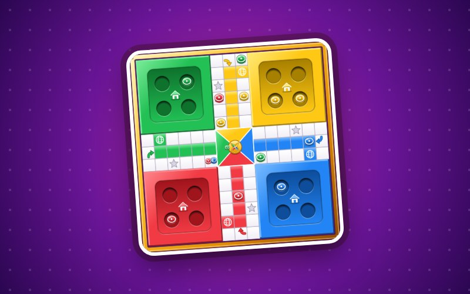

<!-- Header + stats images are generated: edit tools/profile.json, run `python tools/build_pixel.py`.
     Stats and snake are rebuilt daily by .github/workflows/MAIN.yml into the `output` branch. -->

<a href="https://iydebu.com">
  <picture>
    <source media="(prefers-color-scheme: dark)" srcset="Img/header-dark.svg">
    
  </picture>
</a>

Gameplay programmer at Tuttifrutti Interactive and co-developer at Secernate Games, Kochi, India.
I build player mechanics, cutscenes, face animation, engine updates and dev tools in Unreal Engine 5 (C++) and Unity (C#).
I work with AI as my partner, not my servant.

[Portfolio](https://iydebu.com) · [Email](mailto:iydebu.io@gmail.com) · [LinkedIn](https://www.linkedin.com/in/iydebu) · [Telegram](https://t.me/iydebu) · [YouTube](https://www.youtube.com/@iydebu)

### Featured game

**[LudoNow](https://ludonow.iydebu.com/)** · 2026 · solo developer · a Ludo game for phone and PC browsers. Play the computer, friends on one screen, friends in a room, or strangers online. The server rolls the dice and runs the turns, so nobody can cheat. **[▶ Play now](https://ludonow.iydebu.com/)**

`JavaScript` `Cloudflare Workers` `Multiplayer` `SVG`

### Shipped on Steam

&nbsp;

- **The Christopher Redemption - I** · Secernate Games · story-driven action thriller, released 29 Oct 2025
- **Darkarta: A Broken Heart's Quest** · Tuttifrutti Interactive · shipped builds for iOS, Windows and Android

### Own projects

- **[Direwolf](https://direwolf.netlify.app)** · online multiplayer FPS in Unity · [trailer](https://www.youtube.com/watch?v=uDO5v9z0aWU)
- **Drone Shot** · drone flying shooter in Unreal Engine 5 (in progress)
- **LOGIC** · AI coding tutor inside the editor; the learner types every line
- **[Windows Diagnostic Tool](https://github.com/iydebu/Windows-Diagnostic-Tool)** · native C++ health checker with plain-English results
- **[Wingy](https://github.com/iydebu/Wingy_release/releases)** · arcade plane game for Android

### Stack

`C++` `C#` `Python` `TypeScript` `Unreal Engine 5` `Unity` `Blueprints` `Niagara` `Photon` `Netcode` `ASP.NET` `Firebase` `Git` `Blender`

<a href="https://github.com/iydebu?tab=repositories">
  <picture>
    <source media="(prefers-color-scheme: dark)" srcset="https://raw.githubusercontent.com/iydebu/iydebu/output/stats-dark.svg">
    
  </picture>
</a>

<picture>
  <source media="(prefers-color-scheme: dark)" srcset="https://raw.githubusercontent.com/iydebu/iydebu/output/github-contribution-grid-snake-dark.svg">
  
</picture>

Also on [X](https://x.com/iydebu) · [Discord](https://discord.gg/UT99PJeW8z) · [Reddit](https://reddit.com/user/iydebu) · [Instagram](https://instagram.com/iydebu) · [Quora](https://quora.com/profile/Iydebu) &nbsp;|&nbsp; Support: [Buy me a coffee](https://buymeacoffee.com/iydebu) · [Ko-fi](https://ko-fi.com/iydebu) · [PayPal](https://paypal.me/iydebu) · [UPI](https://payments.cashfree.com/forms/coffee)
